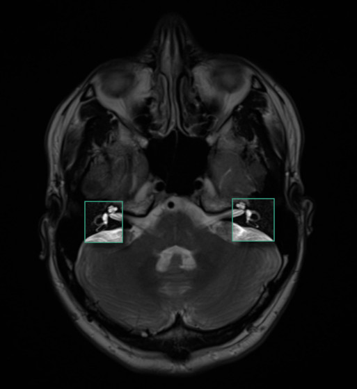

In April 2019, I came down with a nasty case of vertigo. The accute phase lasted
a month, and after that it would come and go, never reaching the original peak
but also never recovering fully. After a long journey with several specialists,
I met with an Otolaryngologist at Johns Hopkins Medicine, where I was cured.
Along the way, I learned a surprising amount of fun science. In this blog post,
I'll share a bit about how the episode felt, what I learned.

## The symptoms

### Nystagmus

The main symptom of Vertigo of course is dizziness. This can be fun when you
induce it yourself, but gets old quickly. When dizziness is chronic, it can be
very difficult to get work done and to help with childcare. Driving is out of
the question.

&quot;<em>Thanks, I hate it</em>&quot; is the correct reaction.

### Displacement

Even when the world was not spinning, my head never felt like it was perfectly
fixed in space. The sensation is hard to discribe, but, imagine that when you
try to focus on something in the distance, that thing is always vibrating just a
little bit, side-to-side and up-and-down, very quickly. Distant objects felt
like they were spread out a little, not perfectly fixed in space. Being
perfectly fixed in space is very much a feeling that we take for granted. You
only recognize it after you lose it for a while.

### Noise

The last symptom I felt is much harder to describe - something like the
sensation of nails on a chalkboard (but silent), or at times, the feeling or a
beam of corrupted data, eminating from the back of my head and toward the left.
I haven't heard others describe anything like this with their vertigo. But for
me, it was correlated with times of dizziness, and very uncomfortable. In the
early days before the dizziness got strong, there was a feeling of a very soft
corkscrew slowly rotating in my skull - this was actually pleasant.

## The inner ear

Several players from the anatomy of the inner ear came together to give me my
vertigo. The way that they interact is interesting. Consider the [hair
cell](https://en.wikipedia.org/wiki/Hair_cell), the cells in the cochlea that
are excited by the fluid oscillations causd by sound waves. They have a lot of
special adaptations that allow them to meet some difficult constraints - being
sensitive enough to detect tiny vibrations, while remaining sensitive and not
being torn to pieces by vibrations that are 10 orders of magnitude larger.

These cells' mix of sensitivity and resilience is wild, and the mechanisms
surely were not easy for evolution to come by. Naturally, other uses were found
for them.

### Vestibular sensation

The same type of cell is used for two sensations that seem completely
unrelated to hearing - the static sense of head orientation, and the sense of
head rotation.

To detect rotation of the head, each ear has three ring-shaped tracks, roughly
aligned with the three spatial axes. The rings are filled with fluid, which has
some inertia. Again, hair cells embedded in jelly sit at the base of the rings
and are stimulated by the speed difference between the ring's fluid and the ring
wall. These rings are called the <em>semicircular canals</em>, and they are
large enough to see in a MRI scan. If you'd like to see <em>my</em>
semi-circular canals, feast your eyes.

To detect static head orientation, we need to make use of gravity. Imagine you
are a Dutchman, you have your buttered toast with heavy chocolate sprinkles[^sprinkles]
(above figure, right side). Lean your toast forward and the weight of sprinkles
will pull them forward while putting a shearing force on the butter. In the
inner ear, instead of sprinkles we have heavy calcium crystals called
<em>otoconia</em>. And instead of butter, we have a kind of jelly. Hair cells
line the tissue beneath the jelly (the toast in our metaphor) and send setsitive
projections through the jelly to detect the sheer force.

## Trouble in science paradise

Look back at the Britannica diagram, and notice the area colored pink. This
includes both the utricle/saccule with their otoconia, and also the semicircular
canals. Although they are separate organs, they are part of the same congiguous
fluid-filled area. Part of the cochlea, too, lies in the same fluid bath.

Like any open office plan, this setup has problems. The otoconia crystals
sometimes dislodge from their jelly and float into the semicircular canal. A
crystal in the canal is not something that the vestibular system can easily cope
with. The heavy crystals interfere with the motion of the fluid in the canals
during head rotation. And when the head becomes stationary, a crystal under the
force of gravity creates a ficticious sense of head movement.

## One weird trick...

One of my common complaints about science is that we develop appealing models and
simple stories, but they fall over for one reason on another in the face of
simple predictions and extrapolations.

Loose crystals from one sensory organ tresspassing into the working end of
another sesnory organ is a simple model. What made my vertigo story so
delightful to me was the way the model works in practice, to suggest a cure that
requires no drugs or prolonged therapy. The treatment is called the Epley
Maneuver.

If (a) crystals can get into the semicircular canals, (b) this cause problems
when crystals move and interfere with fluid sensors and (c) the shapes of the
canals are well known, then perhaps by rotating the head a certain way we could
coax the crystals back through the canals and into the utricle where they
belong, a bit like the toy with a marble navigated through a maze on a balance
board you control with knobs?

Well, for that subset of vertigo cases where loose crystals are the cause, it
does work. And one has to wonder, when Epley first tried it successfully, was
this a Eureka! moment for him, or with total confidence in the crystal
hypothesis did he shrug the maneuver's success off as trivial.

When the right side (most commonly, the hindmost of the three canals) is the
problem, the crystals tend to settle at a low point in the ring, and we want to
get them around the top of the ring and back into the utricle. The maneuver goes like this:

  - Sit straight up
  - Turn the head 45 degrees to the right
  - Keeping the turn, lay back fairly quickly, letting the head hang below the sholders
  - After the nystagmus subsides, remain lying down and turn the head toward the opposite side
  - After the next wave of nystagmus subsides, roll onto your left side, keeping your
    head turned toward your left shoulder
  - After the next wave of nystagmus subsides, lift your body to a sitting position
 
 To see why this works, try the procedure on the model head below. The model
 has two loose crystals in his right canal. The controls are tricky, but if you
 get the sequence right, they will land on the green "utricle" and be stable
 there as long as the head stays upright.

<!-- 
 -->
<!--   
Click to start
 -->
<!--    -->
<!-- 
 -->

<iframe srcdoc="
<html>
<body style='margin:0px'>

  
Click to start

  

</body>
</html>
" width="600px" height="410px"></iframe>

If the head can bec back to the upright position without the red crystals
falling back down, you win!

## Feels

As you can see in the simulation, when the head is still, gravity brings the
crystals to their lowest location. A few minutes after lying down in bed, things
in the inner ear are settled down. The fluid motion sensors are not being
activated. Everything feels back to normal.

Being still in bed is so comfortable, in fact, that you can start to wonder if
the whole condition is clearing up and you can go back to normal activities
soon. But, for quite some time, sitting up very reliably brings back the vertigo
and all the discomfort. This ends up training you not to leave the bed, to spend
a long time after waking up in an anxious state, temporarily cured and hoping
that you will still be ok when you get up, but knowing that probably won't
happen. It's emotionally hard, and during this episode, I gained a ton of 
sympathy for people with chronic illness.

### Treatment

Here is a rough breakdown of the medical care I received, with the cost after insurance.

Date        Center                  Cost 
------      --------                ------ 
2019-06-02  Urgent Care             $150
2019-06-02  Union Memorial Hospital $800
2019-06-20  Mercy Otolaryngology    $100
2019-07-20  Mercy Neurology         $150
2019-08-02  Mercy Radiology         $150
2019-12-03  Hopkins Otolaryngology  $100

The first two trips happened because the dizziness came on so strongly that my
wife and I thought there may be a serious issue. Urgent Care also didn't want to
rule anything out, and they urged us to go to the ER (it was fairly late at
night, and I couldn't reach my family physician).

I was perscribed nausea medicine and told that I probably had viral
labrynthitis, which should resolve itself it 3 to 14 days. While the strongest
phase did die down after a couple of weeks, I had the residual feelings
mentioned above. They could come and go, maybe once a month I had a week of
symptoms.

So I kept seeing other specialists. An otolaryngologist at Mercy Medical agreed
that it was viral labrynthitis and prescribed low-dose valium and waiting. We
decided not to take the valium - due to the wait times before our visits, the
visit tended to happen on the tail end of a bout of vertigo, and I was scared of
taking anything psychoactive when the symptoms were subsiding anyway.

The trip to Mercy Neurology was recommended because of the stranger symytoms I
mentioned above. The nails-on-the-board, the beam of corrupt information - these
things hinted that there may be something wrong with my noodle. But the battery
of tests didn't turn up anything, and my MRI scans looked normal.

In summary, the treatment from June through August was kind and caring, but
didn't make much progress in clearing up the symptoms.

### The Fix

As it happens, my wife studied the neurons of the vestibular system[^xpl2016]
and the hair cells of the utricle[^xpl2016b] in her doctoral and postdoc labs,
which were hospital-affiliated. She managed to use some of her connections to
get me an appointment at Johns Hopkins Otolaryngology. I'll add that she did
this without much help from me - in a typical partners dynamic, I was resistent
to seeing more doctors after having had so little success in the past.

I'm grateful she did, though. Becuase the doctor I saw, Yuri Agarwal, finally
diagnosed the issue and solved it during the office visit with the Epley
maneuver.

I noticed the impact when I left the office and got into my car. I was between
episodes at the time - I thought that I felt mostly fine, not dizzy. In truth, I
had adapted to much of the vertigo. And after the treatment, all of the residual
symptoms that I had gotten used to disappeared. I felt like I could perfectly
focus on distant points. I could move my head around quickly and easily focus on
several objects a second (during a dizziness episode, I couldn't drive; between
episodes, I drove rigidly, giving myself lots of extra time before making turns,
since it took longer for me to look around at all the surroundings). The general
sense of "displacement" was gone. It had been 5 months since I started feeling
bad, and now, I felt like I had super-powers. There was a lot of happy giggling
on my solo drive home from Hopkins Medical.

Thank you, Dr. Agarwal!

## Disclaimer

During my visit with Dr. Agarwal, which had the fast pacing of a doctor who
leads a dual life as head of a research lab, she explained some of the inner ear
biology that kicked off my exploration, and recommended I look up Richard
Rabbitt, who has done really interesting physical simulation[^rabbitt] of the Epley
maneuver.

There are a lot of inaccuracies in my simulation. To get a much better (though
not interactive) view of how and why the Epley Maneuver works. You can also meet
Dr. John Epley himself![^epley_youtube]

I realize that a lot of this blog post sounds like medical advice. I really want
to emphasize - I'm not a doctor. I have no idea how common BPPV is compared to
other causes of vertigo, so I have no idea how likely the Epley maneuver is to
work for you, if you're having vertigo.

I wanted to share my story, and to try out some ideas that had gotten into my
head (the vertigo simulator and the interactive Epley model above), in the
context of this unpleasant episode in my life.

One takeaway - there can be light at the end of the tunnel, and sometimes
although a partner's involvement in your medical choices can feel a little
overbearing, they may often be right. As I tearfully told her after my
treatment, since I'm naturally reluctant to see doctors, if she hadn't been so
persistent then I might have gone the rest of my life with on-and-off BPPV.

## Footnotes

[^rabbitt]: [Wave mechanics of the vestibular semicircular
    canals](https://www.ncbi.nlm.nih.gov/pubmed/28877495) on PubMed

[^epley_youtube]: An educational VHS video destribing BPPV and the Epley Maneuver.
John Epley gives part of the introduction. [https://www.ncbi.nlm.nih.gov/pubmed/28877495](https://www.ncbi.nlm.nih.gov/pubmed/28877495)

[^sprinkles]: [De
    Ruijter](https://www.worldmarket.com/product/de-ruijter-milk-chocolate-sprinkles.do)
    chocolate sprinkles, a popular topping for toast in Holland.

[^xpl2016]: [Sodium channel diversity in the vestibular ganglion: NaV1.5,
    NaV1.8, and tetrodotoxin-sensitive
    currents](https://www.ncbi.nlm.nih.gov/pubmed/26936982) on PubMed

[^xpl2016b]: [Functional development of mechanosensitive hair cells in stem
    cell-derived organoids parallels native vestibular hair
    cells](https://www.ncbi.nlm.nih.gov/pubmed/?term=liu+holt+utricle) on PubMed
